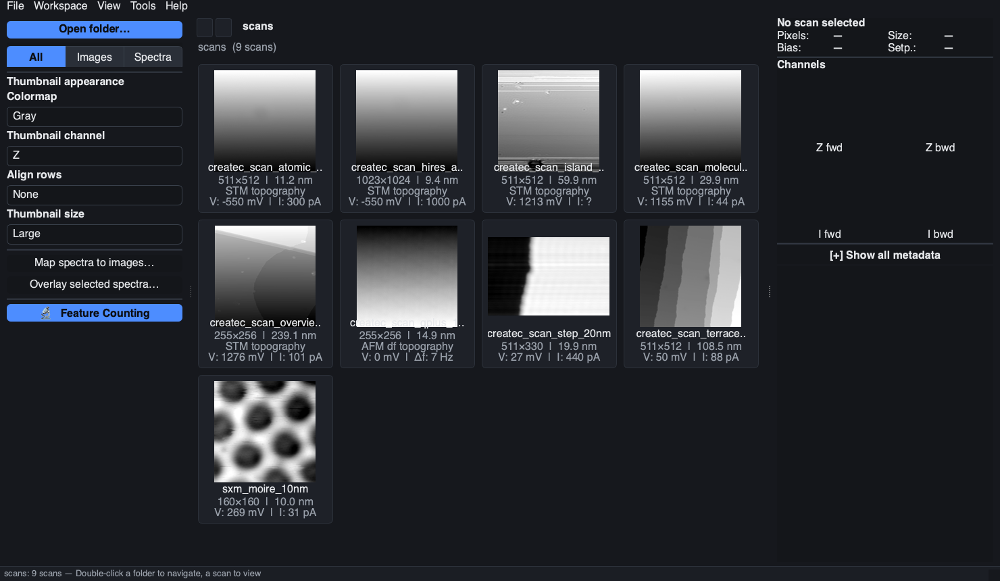
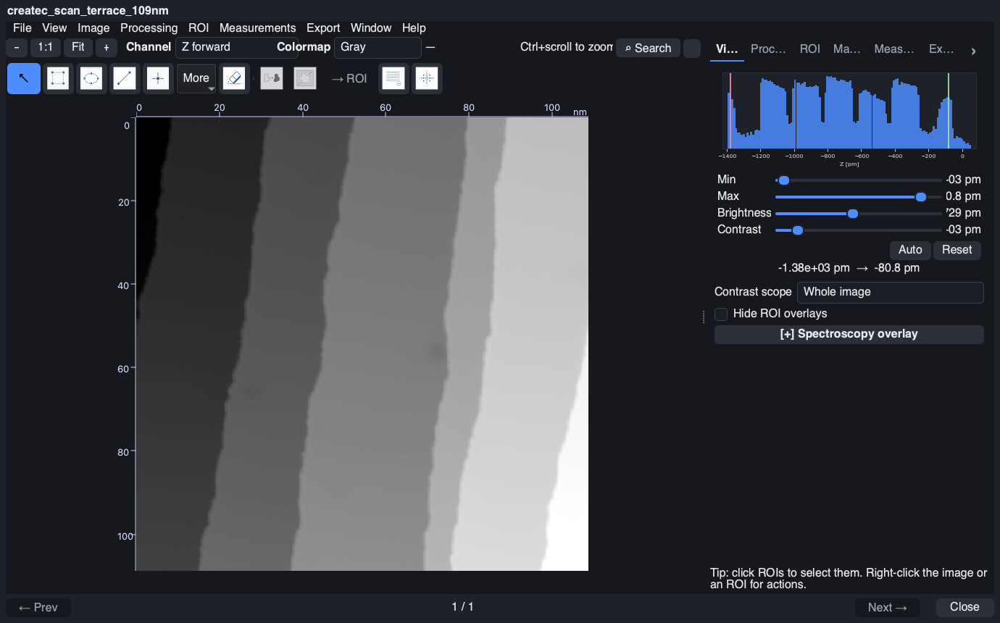

<p align="center">
  
</p>

# ProbeFlow

ProbeFlow is a desktop tool for scanning tunnelling microscopy (STM) and
related SPM data. It browses folders of scans and spectra, applies routine
image corrections, measures with ROIs and FFT tools, and exports figures or
data with enough provenance to understand how they were produced — all while
keeping the physical calibration (nm, pA, V) that plain bitmaps lose. It
reads Createc, Nanonis, and RHK files, and includes a command-line interface
for scripting and batch work.

> **Beta software.** ProbeFlow is `0.0.0b0`: the GUI, CLI, Python API, and
> JSON sidecar formats may still change. Raw microscope files are treated as
> read-only — processing and exports always write new files.

## Get started

Python 3.11 or newer is required.

```bash
git clone https://github.com/SPMQT-Lab/ProbeFlow.git
cd ProbeFlow
python -m pip install -e .
probeflow gui
```

Then, in the app:

1. **Open folder…** and point it at a directory of `.dat`, `.sxm`, `.sm4`,
   or spectroscopy files — every supported file appears as a thumbnail.
2. **Double-click a scan** to open the image viewer.
3. Fix the usual artifacts: `Processing → STM scan-line background…`
   (`Ctrl+Alt+B`) or plane subtraction (`Ctrl+Shift+B`), previewing the fit
   before applying.
4. Draw an ROI or line profile, take measurements from the **Measure** tab,
   or open the FFT viewer (`Ctrl+Shift+F`).
5. **Export** the image, profile, table, or processed scan — most exports
   carry a JSON provenance sidecar recording exactly how they were made.

Everything in the viewer is also reachable from the search box (`Ctrl+K`) —
type a few letters of what you want ("background", "profile", "fft").





The step-by-step walkthrough is in the **[GUI guide](docs/gui.md)**; batch
and scripting workflows are in the **[command-line guide](docs/cli.md)**.

## What it does

- **Browse** scans and spectra as thumbnails — channels, colormaps, sorting,
  and a bias filter; raw files are never modified.
- **Process** — row alignment, bad-line repair, background subtraction,
  smoothing/high-pass, edge detection and masks, Fourier filters, TV
  denoising, geometry transforms. Every step is recorded so an export can be
  reproduced.
- **Measure** — rectangle/ellipse/polygon/freehand/line/point ROIs, line
  profiles and periodicity, ROI statistics, step heights, distances and
  angles, feature maxima and point statistics (pair correlation g(r),
  nearest-neighbour spacing, density).
- **FFT tools** — magnitude and radial profile with q in nm⁻¹, draggable
  reciprocal-lattice grids, affine drift correction, mains-pickup notching,
  inverse-FFT reconstruction, and n-fold symmetrization.
- **Spectroscopy** — single traces, overlays, and waterfalls with smoothing,
  derivatives, and normalization on derived display data.
- **Convert and export** — Createc `.dat` → Nanonis `.sxm`, PNG, or NumPy
  `.npy` bundles; export PNG/PDF/CSV/JSON/SXM (and Gwyddion `.gwy` with the
  optional extra), with provenance sidecars.

## Supported files

| Direction | File type | Use |
|---|---|---|
| Input | Createc `.dat` | STM/SPM image scan |
| Input | Createc `.VERT` | Point spectroscopy |
| Input | Nanonis `.sxm` | STM/SPM image scan |
| Input | Nanonis `.dat` | Point spectroscopy |
| Input | RHK `.sm4` | STM/SPM image scan |
| Output | `.sxm`, `.npy` | Converted or processed scan data |
| Output | `.png`, `.pdf` | Figure / image export |
| Output | `.csv`, `.json` | Numerical data, metadata, provenance |
| Output | `.gwy` | Optional Gwyddion export |

## Optional extras

```bash
python -m pip install -e ".[lattice]"    # SIFT lattice-vector extraction (OpenCV, scikit-learn)
python -m pip install -e ".[gwyddion]"   # Gwyddion .gwy writer
python -m pip install -e ".[dev]"        # test + lint tooling
```

Everything else works with the core install (numpy, scipy, Pillow, PySide6,
matplotlib, shapely, scikit-image).

## Using ProbeFlow from Python

```python
from probeflow import load_scan, processing

scan = load_scan("scan.dat")
scan.planes[0] = processing.align_rows(scan.planes[0], method="median")
scan.planes[0] = processing.subtract_background(scan.planes[0], order=1)
scan.save("processed.sxm")
scan.save("processed.png", colormap="gray")
```

## Documentation

- [GUI guide](docs/gui.md) — the full tour with screenshots
- [Command-line guide](docs/cli.md) — inspection, conversion, batch pipelines
- [Createc `.dat` reader notes](docs/createc_dat_reader.md) — format details
- [Contributor notes](CONTRIBUTING.md) — setup, tests, architecture boundaries
- [Review and cleanup status](docs/review_status.md) — code-review record

## Development

```bash
python -m pip install -e ".[dev,lattice]" -c constraints.txt
pre-commit install    # once per clone — runs ruff on every commit
pytest                # run the test suite
ruff check .          # lint (same pinned ruff as CI and the hook)
```

The package layout and architectural boundaries are described in
[CONTRIBUTING.md](CONTRIBUTING.md).

## Acknowledgements

ProbeFlow is developed at [SPMQT-Lab](https://github.com/SPMQT-Lab) at The
University of Queensland.

The original Createc-decoding work was written by
[Rohan Platts](https://github.com/rohanplatts). ProbeFlow builds on that
foundation with browsing, conversion, processing, ROI workflows, spectroscopy
handling, FFT tools, and export provenance.
