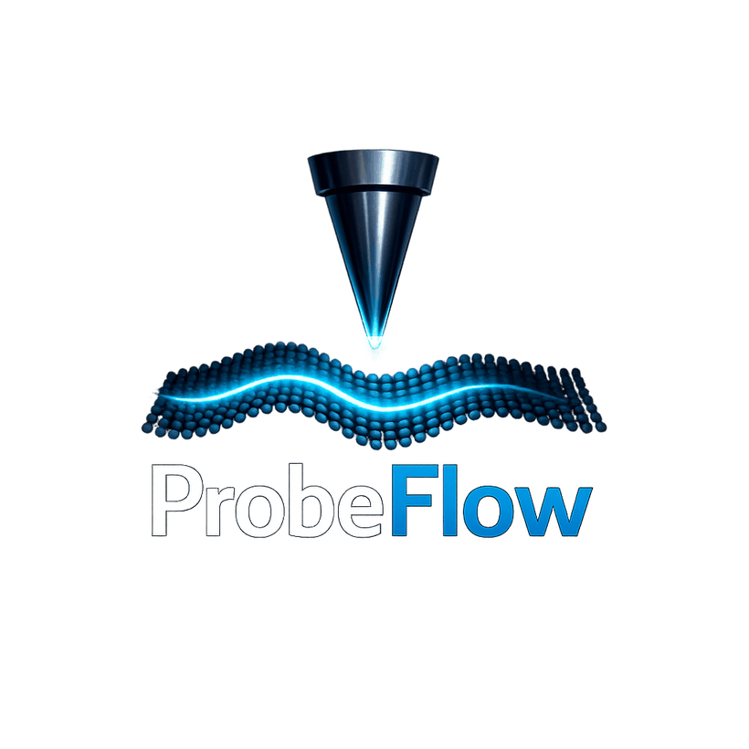

<p align="center">
  
</p>

<h1 align="center">ProbeFlow</h1>
<p align="center"><em>Createc → Nanonis File Conversion</em></p>

---

## What It Does

**ProbeFlow** converts **Createc** raw scan data files (`.dat`) into formats compatible with Nanonis analysis software:

* Createc `.dat` → Nanonis `.sxm`
* Createc `.dat` → `.png` preview images

Three tools are provided:

- `probeflow` — graphical interface (recommended for most users)
- `dat-png`   — CLI: convert to PNG
- `dat-sxm`   — CLI: convert to SXM

---

## Installation

```bash
git clone https://github.com/SPMQT-Lab/Createc-to-Nanonis-file-conversion.git
cd Createc-to-Nanonis-file-conversion
python -m pip install -e .
```

---

## Usage

### Graphical interface (recommended)

```bash
probeflow
```

Opens a window where you can:
- Browse to your input folder of `.dat` files
- Browse to your output folder
- Choose to convert to PNG, SXM, or both
- Adjust contrast clipping under Advanced options
- Toggle dark / light mode
- Watch live progress in the log panel

Your folder selections and preferences are saved automatically between sessions.

---

### Command line

#### Default paths (uses built-in sample data)

```bash
dat-png
dat-sxm
```

#### Custom paths

```bash
dat-png --input-dir path/to/input --output-dir path/to/output
dat-sxm --input-dir path/to/input --output-dir path/to/output
```

#### Optional flags

| Flag | Default | Description |
|------|---------|-------------|
| `--clip-low`  | `1.0`  | Lower percentile for contrast clipping |
| `--clip-high` | `99.0` | Upper percentile for contrast clipping |
| `--verbose`   | off    | Enable debug logging |

---

## Repository Contents

- [`nanonis_tools/`](nanonis_tools) — installable converter source
  - `common.py` — shared utilities (DAC scaling, header parsing, image processing)
  - `dats_to_pngs.py` — PNG conversion
  - `dat_sxm_cli.py` — SXM conversion
  - `gui.py` — ProbeFlow graphical interface
- [`assets/`](assets) — logo and visual assets
- [`src/file_cushions/`](src/file_cushions) — binary layout assets for `.sxm` generation
- [`data/sample_input/`](data/sample_input) — two example `.dat` files
- [`tests/`](tests) — pytest test suite (63 tests)

---

## Notes

- `dat-sxm` writes output files using the input filename stem.
- The `.sxm` timestamp parser expects filenames of the form `AyyMMdd.HHmmss.dat`.
- Cushion files in `src/file_cushions` encode the binary structure of `.sxm` and are required for SXM generation.
- Failed batch conversions are logged to `errors.json` in the output directory.

---

## Acknowledgements

**ProbeFlow** is developed at **[SPMQT-Lab](https://github.com/SPMQT-Lab)**, under the supervision of **Dr. Peter Jacobson** at **The University of Queensland**.

The core conversion algorithms were originally written by **[Rohan Platts](https://github.com/rohanplatts)**. This software is a refactored, extended, and GUI-enabled version of his work. His contributions are the foundation of everything this tool does.

> *"Standing on the shoulders of giants."*
