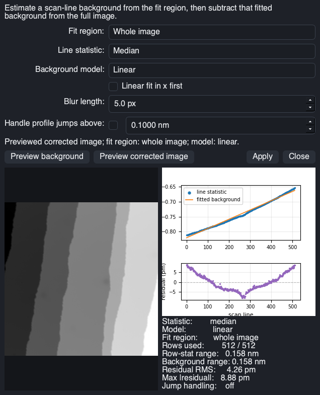
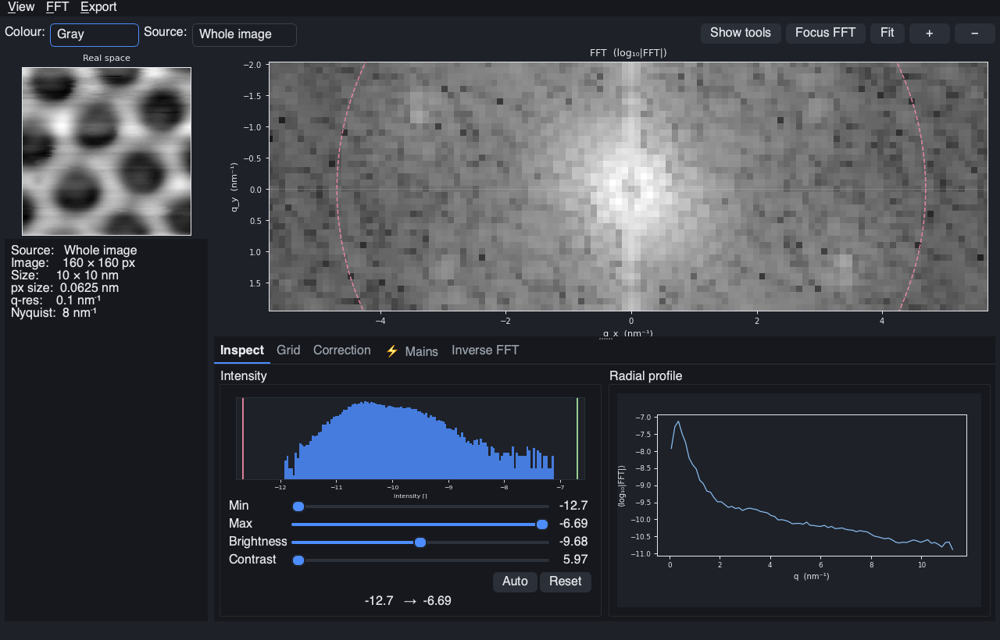
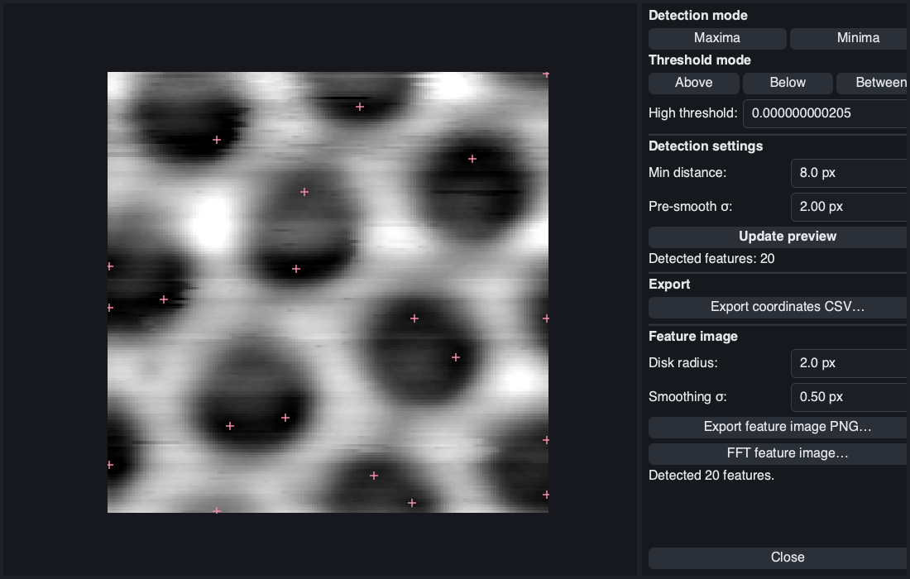

# ProbeFlow GUI

Launch the graphical interface with:

```bash
probeflow gui
```

This guide walks through the most common workflows: loading images,
subtracting a background, exploring the FFT, and finding features.
The screenshots are generated from the real widgets by
`scripts/generate_gui_screenshots.py` — rerun it after UI changes to
refresh them.

## Loading images

Use **File → Open folder...** (or the **Open folder** button in the
sidebar) and pick any folder containing scans. ProbeFlow indexes the
folder and shows a thumbnail for every supported file — Createc `.dat`,
Nanonis `.sxm`, RHK `.sm4`, plus `.VERT` and Nanonis spectroscopy files.


Each card shows the scan size, setpoint, and channel info. The sidebar
controls the thumbnail colormap, channel, row alignment, and size, and the
filter buttons (All / Images / Spectra) narrow the grid. **Double-click a
thumbnail** to open it in the image viewer.


The viewer opens on the raw topography with a histogram and contrast
controls in the right-hand sidebar (View tab). The toolbar above the image
switches channel and colormap; **← Prev / Next →** at the bottom steps
through the other scans in the folder. Every tool in the viewer is also
reachable from the **Search** box (or `Ctrl+K`) — type a few letters of
what you want ("background", "profile", "fft") and pick the command.

Raw microscope files are treated as read-only: everything below operates
on an in-memory copy, and saving always writes a new file.

## Subtracting a background

Scans usually come with a tilted plane or scan-line artifacts. Two tools
remove them:

* **Processing → Plane/background subtraction...** (`Ctrl+Shift+B`) —
  polynomial plane fits.
* **Processing → STM scan-line background...** (`Ctrl+Alt+B`) — per-line
  background estimation designed for terraced STM topographs.



In the STM background dialog:

1. Pick the **Fit region** — the whole image, or the active ROI if you
   have drawn one around a flat terrace.
2. Pick the **Line statistic** (median is robust to steps and tip
   changes) and the **Background model**. Models range from *Linear*
   through *2nd/3rd order polynomial*, *Low-pass* and *Line by line* to
   the *Piezo creep* family — switch between them with the dropdown and
   compare the fits.
3. Click **Preview corrected image**. The right-hand plots show the
   per-line statistic with the fitted background and the residual per
   scan line, plus residual RMS — switch models until the residuals stop
   shrinking.
4. Click **Apply**. The subtraction is recorded in the processing
   history (undo with `Ctrl+Z`), and exports carry the full provenance.

## Performing an FFT

Open **Measurements → FFT viewer...** (`Ctrl+Shift+F`, or the **FFT**
button in the quick toolbar). The viewer computes the FFT of the current
processed image — subtract the background first, or the spectrum is
dominated by the surface tilt.



The left pane shows the real-space source with its pixel and q-space
resolution; the main pane shows log-magnitude FFT with reciprocal-space
axes. The tabs below cover the common reciprocal-space tasks:

* **Inspect** — intensity histogram with min/max/brightness/contrast
  sliders, and a radial profile of the spectrum.
* **Grid** — fit a reciprocal lattice to the Bragg peaks.
* **Correction** — preview lattice undistortion from the fitted grid.
* **Mains** — detect and suppress mains-frequency pickup streaks.
* **Inverse FFT** — mask regions of the spectrum and reconstruct the
  filtered image.

**Focus FFT** and the zoom buttons home in on the spectral content near
the origin, and the **Export** menu saves the spectrum or filtered image.
For a quick periodicity measurement without the full viewer, use
**Measurements → Find spacing from line profile...** on a line ROI.

## Working with Feature Finder

Open **Measurements → Feature finder...** to detect point-like features —
atoms, molecules, defects, moiré sites — on the current image.



1. Choose the **Detection mode**: *Maxima* for protrusions, *Minima* for
   depressions.
2. Choose a **Threshold mode** (*Above*, *Below*, or *Between*) and a
   height threshold so that only genuine features qualify.
3. Set the **Detection settings**: *Min distance* enforces one detection
   per feature, and *Pre-smooth σ* suppresses pixel noise before the
   search.
4. Click **Update preview** — detected features are marked on the image
   and counted.

From the **Export** section you can write the coordinates to CSV, render
a synthetic *feature image* (a disk at every detection, useful for pair
correlation and lattice statistics), or send that feature image straight
to the FFT viewer.

For segmentation-based workflows — particle size statistics, template
matching, classification, lattice extraction — use the **Feature
Counting** window (button in the Browse sidebar). It requires the
optional `features` extra:

```bash
pip install "probeflow[features]"
```

## Beyond the basics

* **ROIs** — draw rectangles, ellipses, and lines from the ROI tab; ROIs
  restrict background fits, FFTs, and statistics, and are saved as
  sidecar files next to the scan.
* **Measurements** — distance and angle measurements, line profiles, ROI
  statistics, step heights, pair correlation.
* **Spectroscopy** — `.VERT` and Nanonis spectroscopy files open in a
  dedicated spectrum viewer; positions can be overlaid on the topograph.
* **Export** — PNG/PDF/CSV/`.sxm`/`.gwy` export with the full processing
  history embedded, so any image can be reproduced from the raw file.

See [cli.md](cli.md) for the command-line equivalents of these
workflows.
